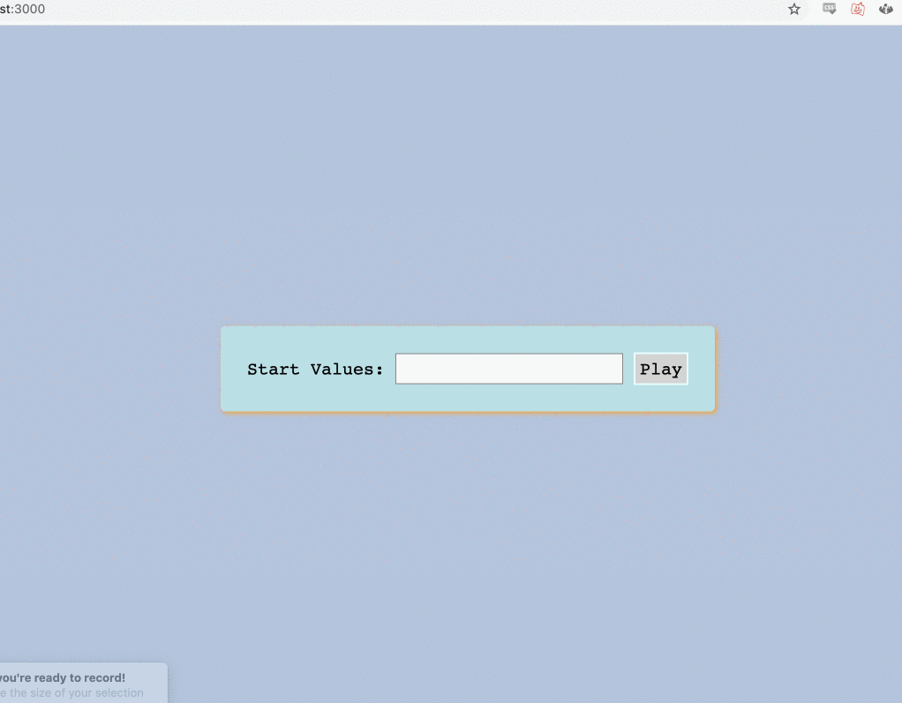

# Blackjack Simulator

install dependencies:
> npm install

in src/:
> node app.js

enter optional starting card value sequence in the text field, delimited with commas

eg. ``A,A,A,A`` will place all aces at the top of the deck

sample gameplay:

